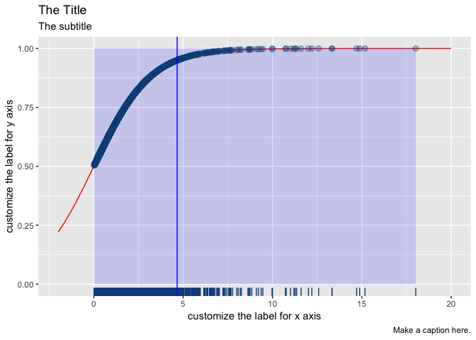
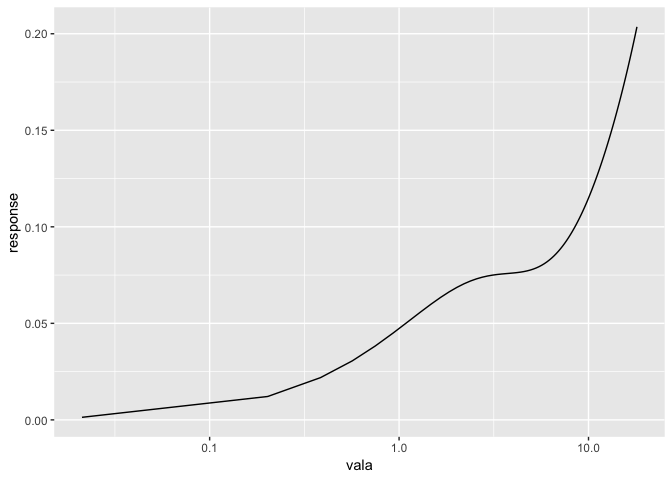
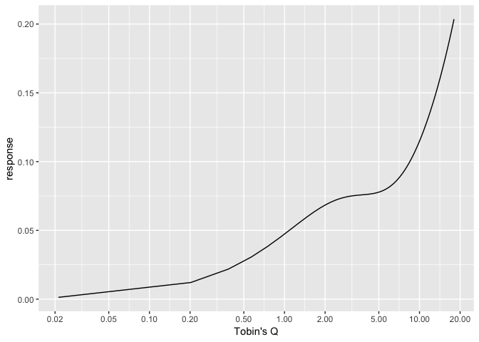

<!-- README.md is generated from README.Rmd. Please edit that file -->
PSTR version 1.2.4 (Orange Panel)
=================================

[](https://cran.r-project.org/package=PSTR)   

The PSTR package implements the Panel Smooth Transition Regression (PSTR) modelling. You can find the package on CRAN, see

[PSTR@CRAN](https://cran.r-project.org/web/packages/PSTR)

The modelling procedure consists of three stages: Specification, Estimation and Evaluation. The package offers tools helping the users to conduct model specification tests, to do PSTR model estimation, and to do model evaluation.

The cluster-dependency and heteroskedasticity-consistent tests are implemented in the package.

The wild bootstrap and cluster wild bootstrap tests are also implemented.

Parallel computation (as an option) is implemented in some functions, especially the bootstrap tests. Therefore, the package suits tasks running many cores on super-computation servers.

How to install
--------------

You can either install the stable version from CRAN

``` r
install.packages("PSTR")
```

or install the development version from GitHub

``` r
devtools::install_github("yukai-yang/PSTR")
```

provided that the package "devtools" has been installed beforehand.

Example
-------

After installing the package, you need to load (attach better say) it by running the code

``` r
library(PSTR)
```

You can first check the information and the current version number by running

``` r
version()
#> PSTR version 1.2.4 (Orange Panel)
```

Then you can take a look at all the available functions and data in the package

``` r
ls( grep("PSTR", search()) ) 
#>  [1] "EstPSTR"         "EvalTest"        "Hansen99"       
#>  [4] "LinTest"         "NewPSTR"         "plot_response"  
#>  [7] "plot_target"     "plot_transition" "sunspot"        
#> [10] "version"         "WCB_HETest"      "WCB_LinTest"    
#> [13] "WCB_TVTest"
```

### The data

In the package, a data set called "Hansen99" is offered to give prompt example. For details of the data set, you can run

``` r
?Hansen99 
```

### Initialization

You can create a new object of the class PSTR by doing

``` r
pstr = NewPSTR(Hansen99, dep='inva', indep=4:20, indep_k=c('vala','debta','cfa','sales'),
               tvars=c('vala'), im=1, iT=14)
print(pstr)
#> ###########################################################################
#> ## PSTR 1.2.4 'Orange Panel'
#> ###########################################################################
#> ***************************************************************************
#> Summary of the model:
#> ---------------------------------------------------------------------------
#>   time horizon sample size = 14,  number of individuals = 560
#> ---------------------------------------------------------------------------
#> Dependent variable:  inva
#> ---------------------------------------------------------------------------
#> Explanatory variables in the linear part:
#>   dt_75 dt_76 dt_77 dt_78 dt_79 dt_80 dt_81 dt_82 dt_83 dt_84 dt_85 dt_86 dt_87 vala debta cfa sales
#> ---------------------------------------------------------------------------
#> Explanatory variables in the non-linear part:
#>   vala debta cfa sales
#> ---------------------------------------------------------------------------
#> Potential transition variable(s) to be tested:
#>   vala
#> ###########################################################################
#> ***************************************************************************
#> Results of the linearity (homogeneity) tests:
#> ***************************************************************************
#> Sequence of homogeneity tests for selecting number of switches 'm':
#> ***************************************************************************
#> ###########################################################################
```

It says that the data set "Hansen99" is used, the dependent variable is "inva", the variables in the data from column 4 to 20 are the explanatory variables in the linear part (though you can write down the names of them), the explanatory variables in the nonlinear part are the four ones in "indep\_k", and the potential transition variable is "vala" (Tobin's Q).

Now you can see that the "NewPSTR" is basically defining the settings of the model.

Note that you can print the object of the class PSTR. By default, it gives you a summary of the PSTR model. They are mainly about which one is the dependent variable, which ones are explanatory variables and etc..

### Specification

The following code does linearity tests

``` r
pstr = LinTest(use=pstr) 
print(pstr, "tests")
#> ###########################################################################
#> ## PSTR 1.2.4 'Orange Panel'
#> ###########################################################################
#> ***************************************************************************
#> Results of the linearity (homogeneity) tests:
#> ---------------------------------------------------------------------------
#> LM tests based on transition variable 'vala'
#>   m  LM_X PV  LM_F PV HAC_X        PV HAC_F        PV
#>   1 125.3  0 28.99  0 30.03 4.819e-06 6.952 1.396e-05
#> ***************************************************************************
#> Sequence of homogeneity tests for selecting number of switches 'm':
#> ---------------------------------------------------------------------------
#> LM tests based on transition variable 'vala'
#>   m  LM_X PV  LM_F PV HAC_X        PV HAC_F        PV
#>   1 125.3  0 28.99  0 30.03 4.819e-06 6.952 1.396e-05
#> ***************************************************************************
#> ###########################################################################
```

You can see that the function "LinTest" takes the PSTR object "pstr" and overwrites it when return. This is the way I recommend as the functions handling the PSTR object in the package update the object by adding new atrributes or members. However, the same function will change the values of the attributes it adds. You can of course create new PSTR objects to take the return values in order to save the results from different settings of the model.

You can do the wild bootstrap and wild cluster bootstrap by running the following code. (Warning! Don't run it except that you have at least 50 cores!)

``` r
iB = 5000 # the number of repetitions in the bootstrap
library(snowfall)
pstr = WCB_LinTest(use=pstr,iB=iB,parallel=T,cpus=50)
```

It takes a long long time to run the bootstrap. This function is developed for those who work on some super-computation server with many cores and a large memory. Note that you will have to attach the "snowfall" package manually.

But of course, you can try the function on your personal computer by reducing the number of repetitions and the cores.

``` r
pstr = WCB_LinTest(use=pstr,iB=4,parallel=T,cpus=2)
```

### Estimation

When you determine which transition variable to use for the estimation, in this case "inva", you can estimate the PSTR model

``` r
pstr = EstPSTR(use=pstr,im=1,iq=1,useDelta=T,par=c(-0.462,0), vLower=4, vUpper=4)
print(pstr,"estimates")
```

By default, the "optim" method "L-BFGS-B" is used, but you can change the method for estimation by doing

``` r
pstr = EstPSTR(use=pstr,im=1,iq=1,useDelta=T,par=c(-0.462,0), method="CG")
print(pstr,"estimates")
#> ###########################################################################
#> ## PSTR 1.2.4 'Orange Panel'
#> ###########################################################################
#> ***************************************************************************
#> Results of the PSTR estimation:
#> ---------------------------------------------------------------------------
#> Transition variable 'vala' is used in the estimation.
#> ---------------------------------------------------------------------------
#> Parameter estimates in the linear part (first extreme regime) are
#>        dt_75_0   dt_76_0   dt_77_0   dt_78_0  dt_79_0  dt_80_0   dt_81_0
#> Est  -0.002827 -0.007512 -0.005812 0.0003951 0.002464 0.006085 0.0004164
#> s.e.  0.002431  0.002577  0.002649 0.0027950 0.002708 0.002910 0.0029220
#>        dt_82_0   dt_83_0    dt_84_0  dt_85_0   dt_86_0   dt_87_0  vala_0
#> Est  -0.007802 -0.014410 -0.0009146 0.003467 -0.001591 -0.008606 0.11500
#> s.e.  0.002609  0.002701  0.0030910 0.003232  0.003202  0.003133 0.04073
#>       debta_0   cfa_0  sales_0
#> Est  -0.03392 0.10980 0.002978
#> s.e.  0.03319 0.04458 0.008221
#> ---------------------------------------------------------------------------
#> Parameter estimates in the non-linear part are
#>        vala_1 debta_1    cfa_1  sales_1
#> Est  -0.10370 0.02892 -0.08801 0.005945
#> s.e.  0.03981 0.04891  0.05672 0.012140
#> ---------------------------------------------------------------------------
#> Parameter estimates in the second extreme regime are
#>      vala_{0+1} debta_{0+1} cfa_{0+1} sales_{0+1}
#> Est    0.011300    -0.00500   0.02183    0.008923
#> s.e.   0.001976     0.01739   0.01885    0.004957
#> ---------------------------------------------------------------------------
#> Non-linear parameter estimates are
#>       gamma        c_1
#> Est  0.6299 -0.0002008
#> s.e. 0.1032  0.7252000
#> ---------------------------------------------------------------------------
#> Estimated standard deviation of the residuals is 0.04301
#> ***************************************************************************
#> ###########################################################################
```

The argument "useDelta" determines the type of the initial value for the smoothness parameter. By default "useDelta = F" means that the first initial value in "par" is the "gamma" instead of "delta". Here we use the settings "useDelta = T" and "par = c(1.6, .5)" means that the first value of "par" is the "delta" and its value is 1.6. Note that "delta" and "gamma" has the relationship "gamma = exp(delta)". Thus, the following two sentences are equivalent

``` r
pstr = EstPSTR(use=pstr,im=1,iq=1,useDelta=T,par=c(-0.462,0), method="CG")
pstr = EstPSTR(use=pstr,im=1,iq=1,par=c(exp(-0.462),0), method="CG")
```

For details, read the vignette.

Now you can plot the estimated transition function by running

``` r
plot_transition(pstr)
```


or a better plot with more arguments

``` r
plot_transition(pstr, fill='blue', xlim=c(-2,20), color = "dodgerblue4", size = 2, alpha=.3) +
  ggplot2::geom_vline(ggplot2::aes(xintercept = pstr$c - log(1/0.95 - 1)/pstr$gamma),color='blue') +
  ggplot2::labs(x="customize the label for x axis",y="customize the label for y axis",
       title="The Title",subtitle="The subtitle",caption="Make a caption here.")
```



Note that the estimation of a linear panel regression model is also implemented. The user can do it by simply running

``` r
pstr0 = EstPSTR(use=pstr)
print(pstr0,"estimates")
#> ###########################################################################
#> ## PSTR 1.2.4 'Orange Panel'
#> ###########################################################################
#> ***************************************************************************
#> A linear panel regression with fixed effects is estimated.
#> ---------------------------------------------------------------------------
#> Parameter estimates are
#>          dt_75     dt_76     dt_77    dt_78    dt_79    dt_80    dt_81
#> Est  -0.007759 -0.008248 -0.004296 0.002356 0.004370 0.008246 0.004164
#> s.e.  0.002306  0.002544  0.002718 0.002820 0.002753 0.002959 0.002992
#>          dt_82     dt_83    dt_84    dt_85    dt_86     dt_87     vala
#> Est  -0.005294 -0.010040 0.006864 0.009740 0.007027 0.0004091 0.008334
#> s.e.  0.002664  0.002678 0.003092 0.003207 0.003069 0.0030080 0.001259
#>          debta     cfa    sales
#> Est  -0.016380 0.06506 0.007957
#> s.e.  0.005725 0.01079 0.002412
#> ---------------------------------------------------------------------------
#> Estimated standard deviation of the residuals is 0.04375
#> ***************************************************************************
#> ###########################################################################
```

### Evaluation

The evaluation tests can be done based on the estimated model

``` r
## evaluatio tests
pstr1 = EvalTest(use=pstr,vq=pstr$mQ[,1])
```

Note that in the "EvalTest", only one transition variable is taken each time for the no remaining nonlinearity test. This is different from the "LinTest" function which can take several transition variables. This is the reason why I save the results into new PSTR objects "pstr1" instead of overwriting. By doing so, I can save more test results from different transition variables in new objects.

The user can also do the wild bootstrap and wild cluster bootstrap in the following way, provided that he or she has the super-computation resources.

``` r
iB = 5000
cpus = 50

## wild bootstrap time-varyint evaluation test 
pstr = WCB_TVTest(use=pstr,iB=iB,parallel=T,cpus=cpus)

## wild bootstrap heterogeneity evaluation test
pstr1 = WCB_HETest(use=pstr1,vq=pstr$mQ[,1],iB=iB,parallel=T,cpus=cpus)
```

Note that the evaluation functions do not accept the returned object "pstr0" from a linear panel regression model, as the evaluation tests are designed for the estimated PSTR model but not a linear one.

### Plotting

In the following, I am going to show the new plotting function `plot_response`, which depicts the relationship between
which I called response, some explanatory variable *x*<sub>*i**t*</sub> and the transition variable *q*<sub>*i**t*</sub> in the PSTR model.

The response \[*ϕ*<sub>0</sub> + *ϕ*<sub>1</sub>*g*<sub>*i**t*</sub>(*q*<sub>*i**t*</sub>; *γ*, *c*)\]*x*<sub>*i**t*</sub> is actually the contribution that the varabile *x*<sub>*i**t*</sub> makes to the conditional expectation of the dependent *y*<sub>*i**t*</sub> through the smooth transition mechanism.

We can see that the response against the variable is a straight line if there is no nonlinearity. We can plot a surface if the variable *x*<sub>*i**t*</sub> and the transition variable *q*<sub>*i**t*</sub> are distinct, with z-axis the response, x- and y- axises the two variables. And it becomes a curve if the variable *x*<sub>*i**t*</sub> and the transition variable *q*<sub>*i**t*</sub> are identical.

We make the graph by running

``` r
ret = plot_response(obj=pstr, vars=1:4, log_scale = c(F,T), length.out=100)
```

`ret` takes the return value of the function. We make the graphs for all the four variables in nonlinear part by using `vars=1:4` (variable names can also be used for specification). Note that we do not do it for the variables in the linear part, as they produce straight lines or planes. `log_scale` is a 2-vector of booleans specifying, for each graph, whether the first (some variable in the nonlinear part) or the second (the transition variable) should be log scaled. `length.out` gives the number of points in the grid for producing the surface or curve. A `length.out` of 100 points looks fine enough.

You may think of "what if I don't wanna make all the variables log scaled?". The solution is to make the graphs separately by running something like

``` r
ret1 = plot_response(obj=pstr, vars=1, log_scale = c(F,T), length.out=100)
ret2 = plot_response(obj=pstr, vars=2, log_scale = c(T,T), length.out=100)
```

Let us take a look the elements in `ret`

``` r
attributes(ret)
#> $names
#> [1] "vala"  "debta" "cfa"   "sales"
```

We see that `ret` is a list containing elements whose names are the variables' names that we specified when running `plot_response`.

Yes, but they are now plottable objects in the sense that you can simply plot them by running

``` r
ret$vala
```



The numbers on the x-axis look not so good as it is difficult to find where the turning-point is.

The `ggplot2` package allows us to manually paint the numbers (the PSTR package collaborates very well with some prevailling packages), and even the label on x-axis (and many more).

``` r
ret$vala + ggplot2::scale_x_log10(breaks=c(.02,.05,.1,.2,.5,1,2,5,10,20)) +
    ggplot2::labs(x="Tobin's Q")
```



Now we see very clearly that the turning-point approximately 0.5 cut the curve into two regimes, and the two regimes behave so differently. This graph is about the lagged Tobin's Q's contribution to the expected investment. Low Q firms (whose potentials are evaluated to be low by the financial market) look rather reluctant to change their future investment plan, or maybe get changed.

Then let us proceed to the surfaces. Check the response from the debta by running

``` r
ret$debta
```

The graph is "living" and you can scracth on it by using your mouse. "vala\_y" shows that the y-axis is the Q, and "debta\_x" shows that the x-axis is the debt. The tool bar on up-right helps you to rotate, pan, zoom and save the graph.

Note that the transition variable Q is in log scale while debt is not.

It is very clear that low Q firms' future investment will be affected by the current debt situation. The more debt there is, the less investment there will be. However, it is not the case for high Q firms who has good potential and is not sensitive to the debt.

The following two living graphs are for the cash flow and the sales.

``` r
ret$cfa
```

``` r
ret$sales
```
