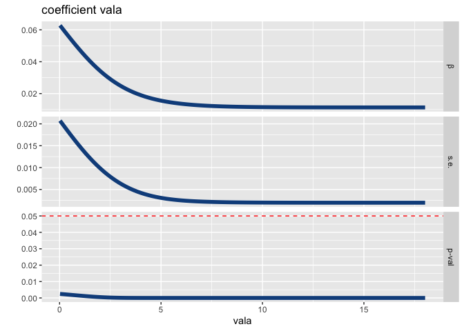

<!-- README.md is generated from README.Rmd. Please edit that file -->

# PSTR version 1.4.0 (Green Panel)

[](https://cran.r-project.org/package=PSTR)


The PSTR package implements the Panel Smooth Transition Regression
(PSTR) modelling. You can find the package on CRAN, see

[PSTR@CRAN](https://CRAN.R-project.org/package=PSTR)

The modelling procedure consists of three stages: Specification,
Estimation and Evaluation. The package offers tools helping the users to
conduct model specification tests, to do PSTR model estimation, and to
do model evaluation.

The cluster-dependency and heteroskedasticity-consistent tests are
implemented in the package.

The wild bootstrap and cluster wild bootstrap tests are also
implemented.

Parallel computation (as an option) is implemented in some functions,
especially the bootstrap tests. Therefore, the package suits tasks
running many cores on super-computation servers.

## How to install

<!--
You can either install the stable version from CRAN

``` r
install.packages("PSTR")
```
or install the development version from GitHub
-->

You can install the package by running

``` r
devtools::install_github("yukai-yang/PSTR")
```

or You can install the package by running

``` r
remotes::install_github("yukai-yang/PSTR")
```

provided that the package `devtools` or `remotes` has been installed
beforehand.

## Example

After installing the package, you need to load (attach better say) it by
running the code

``` r
library(PSTR)
```

You can first check the information and the current version number by
running

``` r
version()
#> PSTR version 2.0.0 (Green Panel)
```

Then you can take a look at all the available functions and data in the
package

``` r
ls( grep("PSTR", search()) ) 
#>  [1] "EstPSTR"           "EvalTest"          "Hansen99"         
#>  [4] "LinTest"           "NewPSTR"           "plot_coefficients"
#>  [7] "plot_response"     "plot_target"       "plot_transition"  
#> [10] "sunspot"           "version"           "WCB_HETest"       
#> [13] "WCB_LinTest"       "WCB_TVTest"
```

### The data

In the package, a data set called `Hansen99` is offered to give prompt
example. For details of the data set, you can run

``` r
?Hansen99 
```

### Initialization

You can create a new object of the class PSTR by doing

``` r
pstr = NewPSTR(Hansen99, dep='inva', indep=4:20, indep_k=c('vala','debta','cfa','sales'),
               tvars=c('vala'), im=1, iT=14)
#> ✔ The PSTR model is ready.
pstr
#> 
#> ── R package PSTR 2.0.0 (Green Panel) ──────────────────────────────────────────
#> 
#> ── Summary of the model ──
#> 
#> The long format panel is 14 × 560 (time × individual).
#> ────────────────────────────────────────────────────────────────────────────────
#> 
#> ── Dependent variable
#> inva
#> 
#> ── Explanatory variables in the linear part (17)
#> dt_75, dt_76, dt_77, dt_78, dt_79, dt_80, dt_81, dt_82, dt_83, dt_84, dt_85,
#> dt_86, dt_87, vala, debta, cfa, sales
#> 
#> ── Explanatory variables in the non-linear part (4)
#> vala, debta, cfa, sales
#> 
#> ── Potential transition variable(s) to be tested (1)
#> vala
```

It says that the data set `Hansen99` is used, the dependent variable is
`inva`, the variables in the data from column 4 to 20 are the
explanatory variables in the linear part (though you can write down the
names of them), the explanatory variables in the nonlinear part are the
four ones in `indep_k`, and the potential transition variable is `vala`
(Tobin’s Q).

Now you can see that the `NewPSTR` is basically defining the settings of
the model.

Note that you can print the object of the class `PSTR`. By default, it
gives you a summary of the PSTR model. They are mainly about which one
is the dependent variable, which ones are explanatory variables and
etc..

### Specification

The following code does linearity tests

``` r
LinTest(pstr) 
#> ✔ Done!
print(pstr, mode="tests")
#> 
#> ── R package PSTR 2.0.0 (Green Panel) ──────────────────────────────────────────
#> 
#> ── Results of the linearity (homogeneity) tests ──
#> 
#> ── LM tests based on transition variable 'vala'
#> 
#> 
#> m            LM_X      LM_F    HAC_X    HAC_F
#> ------  ---------  --------  -------  -------
#> 1        125.2509   28.9922   30.033   6.9518
#> p-val      0.0000    0.0000    0.000   0.0000
#> 
#> ── Sequence of homogeneity tests for selecting number of switches 'm' ──
#> 
#> ── LM tests based on transition variable 'vala'
#> 
#> 
#> m            LM_X      LM_F    HAC_X    HAC_F
#> ------  ---------  --------  -------  -------
#> 1        125.2509   28.9922   30.033   6.9518
#> p-val      0.0000    0.0000    0.000   0.0000
```

or

``` r
pstr$LinTest() 
print(pstr, mode="tests")
```

`LinTest(pstr)` modifies the object in place (R6 uses reference
semantics). The function returns `pstr` invisibly, so you may call it
either for its side effects or in an assignment. The reference semantics
means that the pass of the object to the function leads to a change of
the values inside the object.

You can create a new PSTR objects (the same model with the same data
set) based on another object by running

``` r
pstr0 = pstr$clone()
```

By doing so, the new PSTR object `pstr0` is an independent copy of the
original object, and when you do something on either of the two objects
(`pstr` or `pstr0`), the other one remains unchanged.

You can do, for example, the wild bootstrap and wild cluster bootstrap
by running the following code.

``` r
iB = 5000 # the number of repetitions in the bootstrap
library(snowfall)
WCB_LinTest(pstr,iB=iB,parallel=T,cpus=50)
```

It takes a long long time to run the bootstrap. This function is
developed for those who work on some super-computation server with many
cores and a large memory. Note that you will have to attach the
`snowfall` package manually.

You can try the following code on your own computer by reducing the
number of repetitions and cores.

``` r
WCB_LinTest(pstr,iB=4,parallel=T,cpus=2)
```

### Estimation

After selecting the transition variable (in this example, `vala`), you
can estimate the PSTR model.

``` r
EstPSTR(use=pstr,im=1,iq=1,useDelta=T,par=c(-0.462,0), vLower=4, vUpper=4)
print(pstr, mode="estimates")
```

By default, the `optim` method `L-BFGS-B` is used, but you can change
the method for estimation by doing

``` r
EstPSTR(use=pstr,im=1,iq=1,useDelta=T,par=c(-0.462,0), method="CG")
print(pstr, mode="estimates")
#> 
#> ── R package PSTR 2.0.0 (Green Panel) ──────────────────────────────────────────
#> 
#> ── Results of the PSTR estimation: ──
#> 
#> ℹ Transition variable 'vala' is used in the estimation.
#> 
#> ── Parameter estimates in the linear part (first extreme regime)
#> 
#> 
#>              dt_75_0     dt_76_0     dt_77_0     dt_78_0    dt_79_0
#> --------  ----------  ----------  ----------  ----------  ---------
#> Est        -0.002827   -0.007512   -0.005812   0.0003951   0.002464
#> s.e.        0.002431    0.002577    0.002649   0.0027950   0.002708
#> t-ratio    -1.163000   -2.915000   -2.193000   0.1414000   0.909700
#> 
#> 
#> 
#>             dt_80_0     dt_81_0     dt_82_0     dt_83_0      dt_84_0
#> --------  ---------  ----------  ----------  ----------  -----------
#> Est        0.006085   0.0004164   -0.007802   -0.014410   -0.0009146
#> s.e.       0.002910   0.0029220    0.002609    0.002701    0.0030910
#> t-ratio    2.091000   0.1425000   -2.990000   -5.337000   -0.2959000
#> 
#> 
#> 
#>             dt_85_0     dt_86_0     dt_87_0    vala_0    debta_0
#> --------  ---------  ----------  ----------  --------  ---------
#> Est        0.003467   -0.001591   -0.008606   0.11500   -0.03392
#> s.e.       0.003232    0.003202    0.003133   0.04073    0.03319
#> t-ratio    1.073000   -0.496900   -2.747000   2.82200   -1.02200
#> 
#> 
#> 
#>              cfa_0    sales_0
#> --------  --------  ---------
#> Est        0.10980   0.002978
#> s.e.       0.04458   0.008221
#> t-ratio    2.46400   0.362200
#> 
#> ── Parameter estimates in the non-linear part
#> 
#> 
#>              vala_1   debta_1      cfa_1    sales_1
#> --------  ---------  --------  ---------  ---------
#> Est        -0.10370   0.02892   -0.08801   0.005945
#> s.e.        0.03981   0.04891    0.05672   0.012140
#> t-ratio    -2.60300   0.59140   -1.55200   0.489600
#> 
#> ── Parameter estimates in the second extreme regime
#> 
#> 
#>            vala_{0+1}   debta_{0+1}   cfa_{0+1}   sales_{0+1}
#> --------  -----------  ------------  ----------  ------------
#> Est          0.011300      -0.00500     0.02183      0.008923
#> s.e.         0.001976       0.01739     0.01885      0.004957
#> t-ratio      5.718000      -0.28750     1.15800      1.800000
#> 
#> ── Non-linear parameter estimates
#> 
#> 
#>             gamma          c_1
#> --------  -------  -----------
#> Est        0.6299   -0.0002008
#> s.e.       0.1032    0.7252000
#> t-ratio    6.1040   -0.0002769
#> ℹ Estimated standard deviation of the residuals is 0.04301.
#> ℹ The specification results are ready, run `print(obj, mode="tests")` to show
#>   the results.
```

The argument `useDelta` determines the type of the initial value for the
smoothness parameter. By default `useDelta = FALSE` means that the first
initial value in `par` is the `gamma` instead of `delta`. Here we use
the settings `useDelta = TRUE` and `par = c(1.6, .5)` means that the
first value of `par` is the `delta` and its value is 1.6. Note that
`delta` and `gamma` have the relationship `gamma = exp(delta)`. Thus,
the following two sentences are equivalent

``` r
EstPSTR(use=pstr,im=1,iq=1,useDelta=T,par=c(-0.462,0), method="CG")
EstPSTR(use=pstr,im=1,iq=1,par=c(exp(-0.462),0), method="CG")
```

Note that the estimation of a linear panel regression model is also
implemented. The user can do it by simply running

``` r
EstPSTR(use=pstr0)
print(pstr0, mode="estimates")
#> 
#> ── R package PSTR 2.0.0 (Green Panel) ──────────────────────────────────────────
#> 
#> ── A linear panel regression with fixed effects is estimated. ──
#> 
#> ── Parameter estimates
#> 
#> 
#>                dt_75       dt_76       dt_77      dt_78      dt_79
#> --------  ----------  ----------  ----------  ---------  ---------
#> Est        -0.007759   -0.008248   -0.004296   0.002356   0.004370
#> s.e.        0.002306    0.002544    0.002718   0.002820   0.002753
#> t-ratio    -3.365000   -3.242000   -1.581000   0.835600   1.587000
#> 
#> 
#> 
#>               dt_80      dt_81       dt_82       dt_83      dt_84
#> --------  ---------  ---------  ----------  ----------  ---------
#> Est        0.008246   0.004164   -0.005294   -0.010040   0.006864
#> s.e.       0.002959   0.002992    0.002664    0.002678   0.003092
#> t-ratio    2.786000   1.391000   -1.987000   -3.749000   2.220000
#> 
#> 
#> 
#>               dt_85      dt_86       dt_87       vala       debta
#> --------  ---------  ---------  ----------  ---------  ----------
#> Est        0.009740   0.007027   0.0004091   0.008334   -0.016380
#> s.e.       0.003207   0.003069   0.0030080   0.001259    0.005725
#> t-ratio    3.037000   2.290000   0.1360000   6.619000   -2.861000
#> 
#> 
#> 
#>                cfa      sales
#> --------  --------  ---------
#> Est        0.06506   0.007957
#> s.e.       0.01079   0.002412
#> t-ratio    6.02800   3.299000
#> ℹ Estimated standard deviation of the residuals is 0.04375.
#> ℹ The specification results are ready, run `print(obj, mode="tests")` to show
#>   the results.
```

### Evaluation

The evaluation tests can be conducted after estimating a nonlinear PSTR
model.

``` r
## evaluation tests
EvalTest(use=pstr,vq=as.matrix(Hansen99[,'vala'])[,1])
```

Note that `EvalTest` takes one transition variable `vq` at a time for
the no remaining nonlinearity (heterogeneity) test. This differs from
`LinTest`, which can evaluate several candidate transition variables
through `tvars`.

The user can also run the wild bootstrap (WB) and wild cluster bootstrap
(WCB) versions of the evaluation tests, provided that suitable computing
resources are available.

``` r
iB = 5000
cpus = 50

## wild bootstrap time-varying evaluation test 
WCB_TVTest(use=pstr,iB=iB,parallel=T,cpus=cpus)

## wild bootstrap heterogeneity evaluation test
WCB_HETest(use=pstr,vq=as.matrix(Hansen99[,'vala'])[,1],iB=iB,parallel=T,cpus=cpus)

print(pstr, mode="evaluation")
```

Note that the evaluation functions do not accept the returned object
`pstr0` from a linear panel regression model, as the evaluation tests
are designed for the estimated PSTR model but not a linear one.

### Plotting

After estimating the PSTR model, you can plot the estimated transition
function by running

``` r
plot_transition(pstr)
```


or a better plot with more arguments

``` r
plot_transition(pstr, fill='blue', xlim=c(-2,20), color = "dodgerblue4", size = 2, alpha=.3) +
  ggplot2::geom_vline(ggplot2::aes(xintercept = pstr$c - log(1/0.95 - 1)/pstr$gamma),color='blue') +
  ggplot2::labs(x="customize the label for x axis",y="customize the label for y axis",
       title="The Title",subtitle="The subtitle",caption="Make a caption here.")
```


You can also plot the curves of the coefficients, the standard errors
and the p-values against the transition variable.

``` r
ret = plot_coefficients(pstr, vars=1:4, length.out=100, color="dodgerblue4", size=2)
ret[[1]]
```



The plotting function `plot_response`, which depicts the relationship
between which we refer to as the response, as a function of an
explanatory variable *x*<sub>*i**t*</sub> and the transition variable
*q*<sub>*i**t*</sub>.

The response
\[*ϕ*<sub>0</sub> + *ϕ*<sub>1</sub>*g*<sub>*i**t*</sub>(*q*<sub>*i**t*</sub>; *γ*, *c*)\]*x*<sub>*i**t*</sub>
is actually the contribution of the variable *x*<sub>*i**t*</sub> to the
conditional expectation of the dependent variable *y*<sub>*i**t*</sub>
through the smooth transition mechanism.

We can see that the response against the variable is a straight line if
there is no nonlinearity. If *x*<sub>*i**t*</sub> and
*q*<sub>*i**t*</sub> are distinct, the response can be visualised as a
surface over (*x*<sub>*i**t*</sub>, *q*<sub>*i**t*</sub>), where the
vertical axis represents the response. And it becomes a curve if the
variable *x*<sub>*i**t*</sub> and the transition variable
*q*<sub>*i**t*</sub> are identical.

You can generate these plots by running

``` r
ret = plot_response(obj=pstr, vars=1:4, log_scale = c(F,T), length.out=100)
```

`ret` takes the return value of the function. We make the graphs for all
the four variables in nonlinear part by using `vars=1:4` (variable names
can also be used for specification). Note that we do not do it for the
variables in the linear part, as they produce straight lines or planes.
`log_scale` is a length-2 logical vector indicating whether to apply a
log scale to (i) *x*<sub>*i**t*</sub> and (ii) *q*<sub>*i**t*</sub>,
respectively. `length.out` gives the number of points in the grid for
producing the surface or curve. A `length.out` of 100 points looks fine
enough.

You might ask: what if you want different log-scaling choices for
different variables? The solution is to make the graphs separately by
running something like

``` r
ret1 = plot_response(obj=pstr, vars=1, log_scale = c(F,T), length.out=100)
ret2 = plot_response(obj=pstr, vars=2, log_scale = c(T,T), length.out=100)
```

Let us take a look at the elements in `ret`

``` r
attributes(ret)
#> $names
#> [1] "vala"  "debta" "cfa"   "sales"
```

We see that `ret` is a list containing elements whose names are the
variables’ names that we specified when running `plot_response`.

Yes, but each element is a ggplot object, so you can display it
directly, for example:

``` r
ret$vala
```


The numbers on the x-axis look not so good as it is difficult to find
where the turning-point is.

The `ggplot2` package allows us to manually paint the numbers (the PSTR
package collaborates very well with some prevailing packages), and even
the label on x-axis (and many more).

``` r
ret$vala + ggplot2::scale_x_log10(breaks=c(.02,.05,.1,.2,.5,1,2,5,10,20)) +
    ggplot2::labs(x="Tobin's Q")
```


Now we see very clearly that the estimated turning-point approximately
0.5 splits the curve into two regimes, and the two regimes behave so
differently. This graph is about the lagged Tobin’s Q’s contribution to
the expected investment. Low Q firms (whose potentials are evaluated to
be low by the financial market) look rather reluctant to change their
future investment plan, or maybe get changed.

Then let us proceed to the surfaces. Check the response from the debta
by running

``` r
ret$debta
```

In an interactive R session, the surface can be rotated and zoomed using
the mouse. “vala_y” shows that the y-axis is the Q, and “debta_x” shows
that the x-axis is the debt. The tool bar on up-right helps you to
rotate, pan, zoom and save the graph.

Note that the transition variable Q is in log scale while debt is not.

It is very clear that low Q firms’ future investment will be affected by
the current debt situation. The more debt there is, the less investment
there will be. However, this is not the case for high-Q firms, which
appear to have better growth prospects and are less sensitive to debt.

The following two living graphs are for the cash flow and the sales.

``` r
ret$cfa
```

``` r
ret$sales
```
